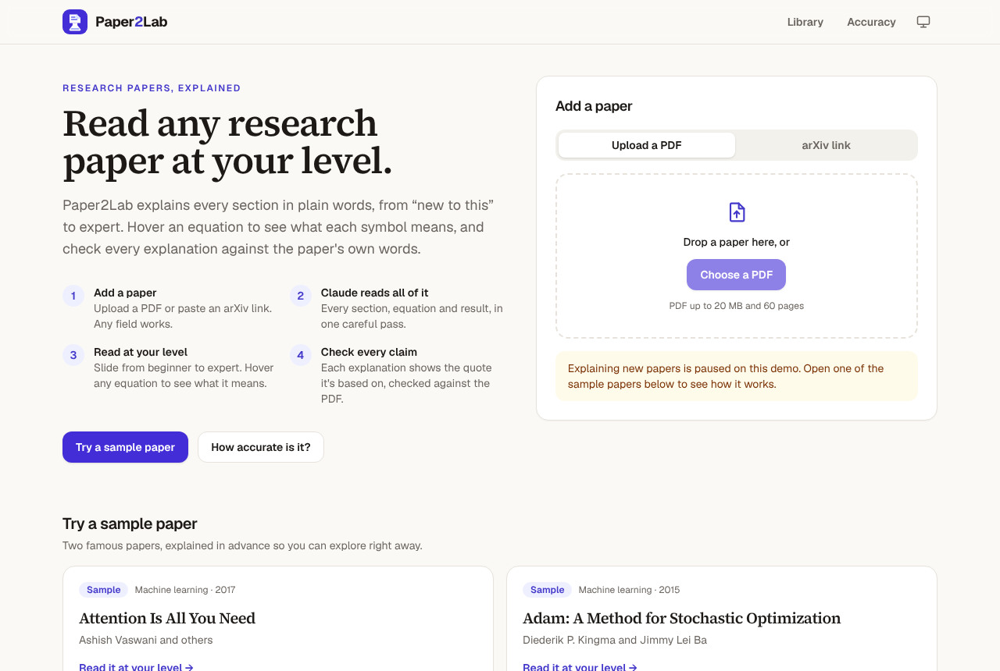
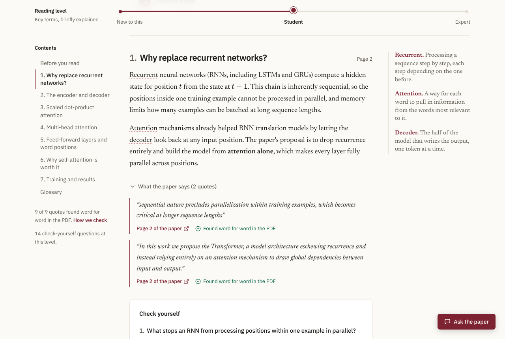
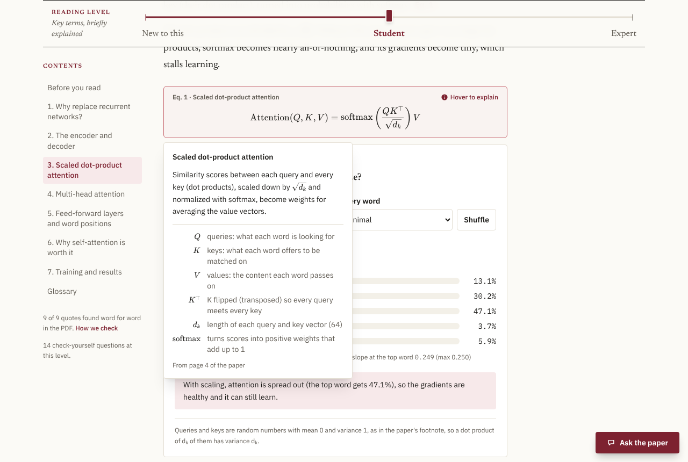
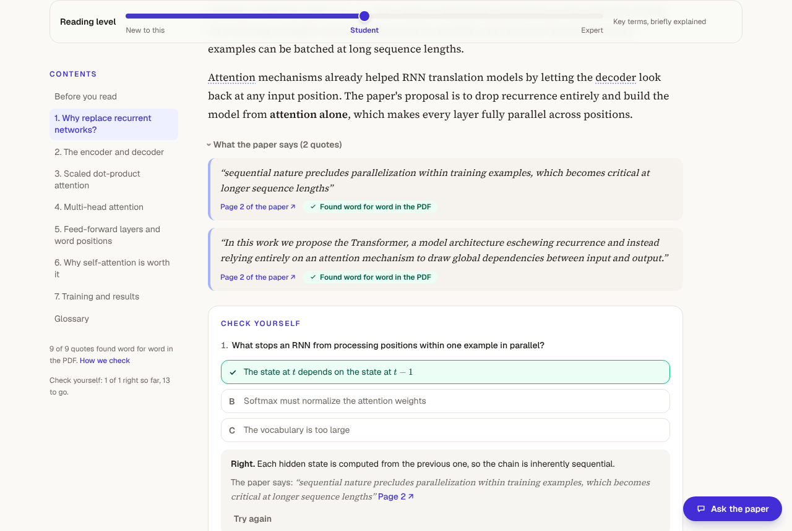
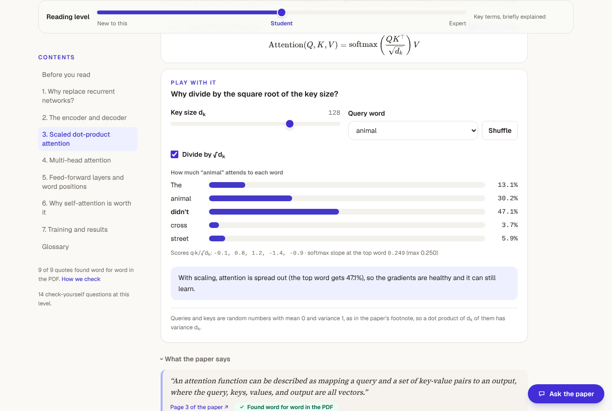
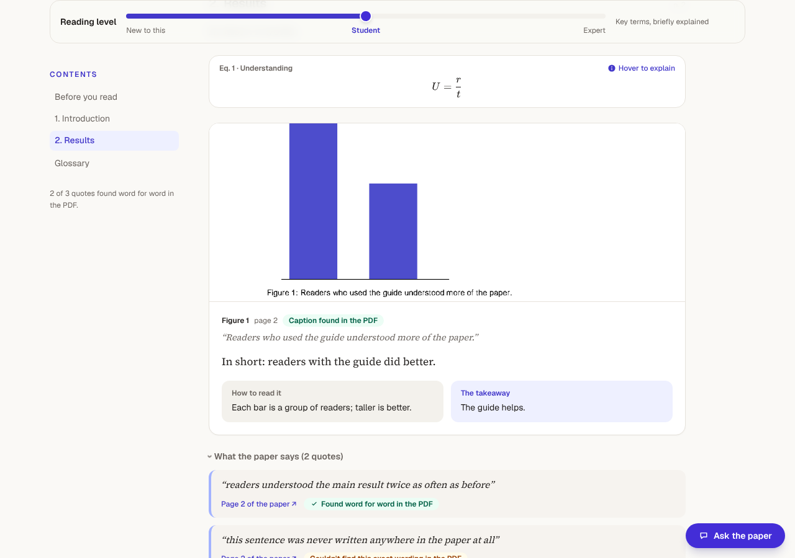
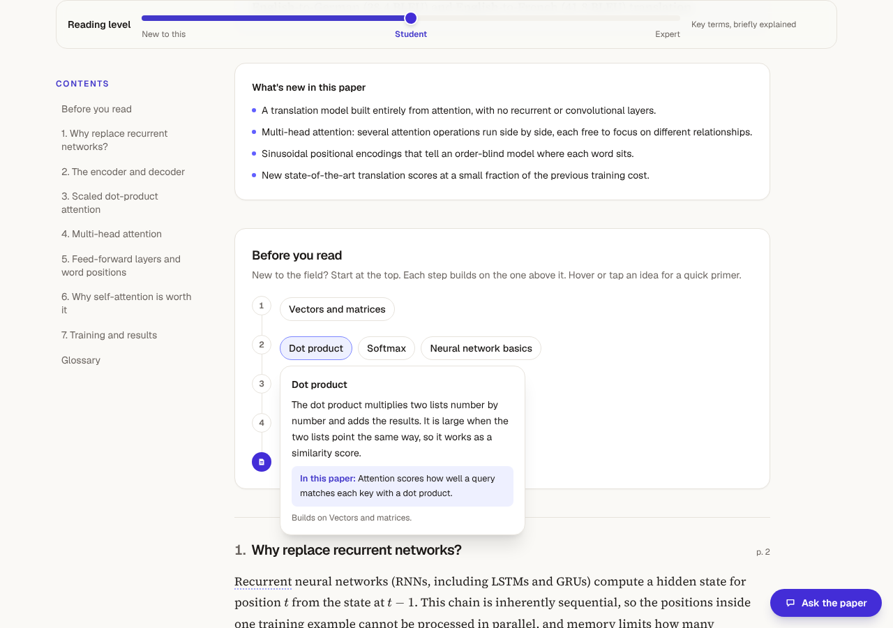
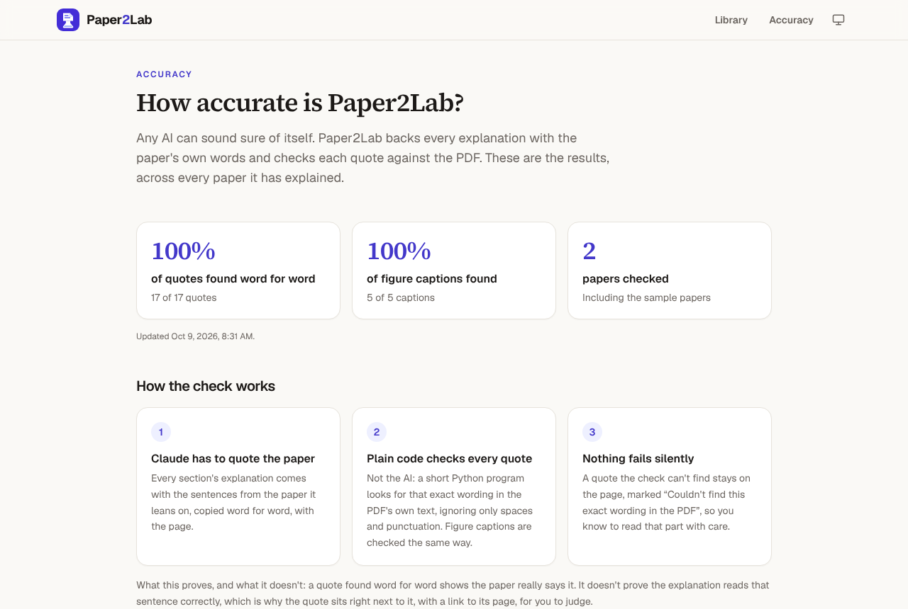

# Paper2Lab

[](https://github.com/whatalshifa/paper2lab/actions/workflows/ci.yml)
[](LICENSE)

**Live demo: [paper2lab-psi.vercel.app](https://paper2lab-psi.vercel.app)**

Read any research paper at your level. Upload a PDF or paste an arXiv link, and Paper2Lab explains
every section in plain words, with a slider from "new to this" to expert. Hover any equation to see
what it says and what each symbol means. Every explanation shows the sentence from the paper it's
based on, checked word for word against the PDF, so you can trust it or catch it out. Then check
yourself with a short quiz, and play with the key equations to see why they work.

> The live demo runs without an AI key, so it shows two sample papers explained in advance
> (*Attention Is All You Need* and *Adam*). Every feature works on them. The API is on a free plan
> that sleeps when idle, so the first visit can take up to a minute to wake it.



| Read at your level | Hover an equation |
|---|---|
|  |  |
| **Check yourself** | **Play with it** |
|  |  |
| **Figures, cut out and explained** | **What to know first** |
|  |  |



## Built with

- **Website:** Next.js 16, React 19, TypeScript, Tailwind CSS 4, KaTeX. Hosted on Vercel.
- **API:** Python 3.12, FastAPI, SQLAlchemy, Alembic, pdfplumber. Hosted on Render.
- **AI:** Claude through the Anthropic API (structured outputs, citations, prompt caching).
- **Data:** Postgres and an S3 bucket on Neon. Semantic Scholar and Hugging Face for references.
- **Quality:** pytest, Playwright (desktop and phone), axe accessibility checks, GitHub Actions.

## What works today (Phases 1 to 5)

- **Add a paper** by uploading a PDF (up to 20 MB and 60 pages) or pasting an arXiv link or id.
  The PDF is checked before any AI sees it: is it really a PDF, how many pages, what text is on each.
- **Claude reads the whole paper in one pass** and returns one structured answer: the paper's
  sections, each explained three ways, its key equations in LaTeX with every symbol explained, a
  glossary, what's new in the paper, and what helps to know first.
- **Reading-level slider.** Three stops: *New to this* (no jargon, everyday analogies), *Student*
  (key terms, briefly defined) and *Expert* (precise, the paper's own terms and numbers). Every
  explanation, summary and equation meaning changes with it. The choice is remembered on the device.
- **Equation hovers.** Equations are drawn with KaTeX. Hover one (or tap it on a phone) to see what
  it means at your level and a table of its symbols. In the text, chips like **Eq. 1** preview the
  equation they mention.
- **Figure explainers.** The paper's key figures and tables are cut out of the PDF and shown inside
  their section, each with what it shows (at your level), how to read it, and its one takeaway.
  Claude only says roughly where a figure is; the cut is then fixed using the PDF itself: the
  caption's words are found on the page, and any chart the cut slices through is kept whole.
  Captions get the same word-for-word check as quotes.
- **Prerequisite map.** "Before you read" lays out what helps to know first, in steps from the most
  basic idea down to the paper. Hover or tap an idea for a short primer and where the paper uses it.
- **Listen.** Reads the summary and every section aloud at your level, with the browser's own
  voice (free, and nothing leaves your device). Maths is said in words ("the square root of d k"),
  with pause, skip and speed controls.
- **Glossary terms.** Technical terms are underlined the first time they appear in a section; hover
  or tap for a one-line meaning.
- **Every explanation shows its source.** Each section comes with one or two quotes from the paper
  and their page. Plain Python then looks for every quote in the PDF's own text (ignoring line
  breaks, hyphenation and ligatures). Found quotes get a green "Found word for word in the PDF" tick
  and their correct page; any that aren't found are marked, so a made-up quote can't pass silently.
  "Page 3 of the paper" opens the PDF at that page.
- **Ask the paper.** A side panel answers questions from the paper alone, at your reading level.
  Every sentence is marked with numbered sources: passages the Anthropic API copied out of the PDF
  itself (its citations feature), each with its page, so an answer can't lean on a quote that isn't
  there. Each paper suggests a few questions to start with. The PDF is cached on the AI side, so
  follow-up questions cost much less than the first.
- **Your library, without an account.** Papers you add belong to your browser (a random key in a
  cookie scripts can't read; only its hash is stored). Nobody else can open, list or delete them.
- **Demo mode.** Without an Anthropic API key the site still works: two sample papers, *Attention
  Is All You Need* and *Adam*, explained in advance, show every feature, including
  prepared answers to their suggested questions. Adding new papers and asking new questions is paused.
- **Spending guards.** Each new paper is one AI call, so there are limits per browser (5 a day), per
  network (10 an hour) and for the whole site (40 a day). Questions
  have their own limits: 30 a day per browser, 40 an hour per network, 300 a day for the site. All
  are settings.
- **Secure by default.** Only the website can call the API (a shared secret the website adds), so
  nobody can skip it to dodge the spending limits. Pages carry a strict content security policy,
  maths from the AI is drawn with KaTeX's safe mode, and the API's docs are hidden in production.
- **Accessible.** Every page is checked against WCAG 2.1 AA with axe, in light and dark mode, as
  part of the browser tests. Everything works with a keyboard.
- **Public accuracy page.** `/accuracy` shows how many quotes and figure captions across every paper
  read were found word for word in the PDF, how the check works, and each sample paper's own score.
- **What the paper connects to.** The papers it builds on, most important first, each with a
  one-line summary and the sentence where it's cited (from Semantic Scholar's free API); code links
  found in the paper itself; and models and datasets on Hugging Face that cite it. Fetched once
  and kept for 30 days.
- **Check yourself.** A few multiple-choice questions at the end of each section, at your level.
  Each answer says why, and shows the paper's own words when a quote backs it. The score is kept in
  your browser. (Sample papers for now; written for every paper once the AI is on.)
- **Play with it.** Interactive demos beside key equations: see why attention divides by √dk (bigger
  keys make softmax pick one word), and race Adam against plain gradient descent down a valley.
- **Ready to share.** Each paper's tab shows its title, links shared on social media get a preview
  image, and there is a sitemap for search engines. When the free API server is waking up, pages
  say so instead of looking stuck.
- **Tested.** 88 backend tests (pytest) and 48 browser tests (Playwright, desktop and phone) run in
  GitHub Actions on every push, plus a check of the sample quotes against the real PDFs on arXiv.

Coming next: quizzes for every paper once the AI is on, and accounts.

## How it fits together

```
Browser ──> Next.js website (Vercel) ──/api/*──> FastAPI (Render) ──> Claude (reads the PDF)
                                                     │
                                                     ├── Postgres (Neon): papers, explanations
                                                     └── S3 bucket (Neon): the PDFs
```

[docs/ARCHITECTURE.md](docs/ARCHITECTURE.md) walks through every part in plain language, and
[docs/DECISIONS.md](docs/DECISIONS.md) explains the main choices.

## Run it on your computer

You need Python 3.12+ and Node 22+.

```bash
# The API (runs in demo mode until you add an ANTHROPIC_API_KEY to backend/.env)
cd backend
python -m venv .venv && source .venv/bin/activate
pip install -r requirements-dev.txt
cp .env.example .env
alembic upgrade head
uvicorn app.main:app --reload --port 8000

# The website, in a second terminal
cd frontend
npm install
npm run dev
```

Open http://localhost:3000. Or run everything with Docker: `docker compose up --build`.

Tests: `cd backend && pytest` and `cd frontend && npx playwright test`.

## Deploying

See [docs/DEPLOY.md](docs/DEPLOY.md): Render (API) + Vercel (website) + Neon (database and PDF
bucket), all on free plans.

## License

MIT. See [LICENSE](LICENSE).
